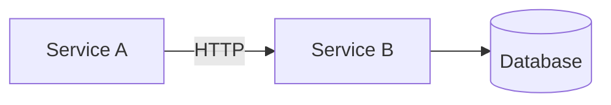

# Diagram

Translate descriptions and structures into clear diagrams on a live Miro board. Use Claude's Miro MCP connection — do not make raw HTTP calls.

## Workflow

1. Identify the diagram type and what needs to be communicated
2. Ask: add to an existing Miro board (provide URL or board ID) or create a new one?
3. Gather all entities, relationships, and flows before touching any tools
4. Plan the coordinate layout on paper before creating items — positions matter
5. Build via Miro MCP tools; return the board link when done

## Diagram Type Selection

| Type | Use When | Layout Direction |
|------|----------|-----------------|
| **Flowchart** | Decision logic, process steps | Top → Bottom |
| **Sequence** | API calls, message flows | Left → Right (swimlanes) |
| **Architecture** | System components and connections | Left → Right or clusters |
| **ER diagram** | Data models, schemas | Grid |
| **Org chart** | Team structure, reporting lines | Top → Bottom |
| **Mind map** | Concepts, brainstorming | Radial from center |
| **Timeline** | Milestones, project schedule | Left → Right |

## Miro MCP Tool Reference

Use these tools via the Claude Miro MCP connection:

```
miro_create_board         — create a new board; returns boardId and viewLink
miro_get_board            — fetch an existing board by ID or URL
miro_create_shape         — create a node (rectangle, circle, rhombus, etc.)
miro_create_sticky_note   — create a sticky note annotation
miro_create_connector     — create an arrow/edge between two items
miro_create_frame         — create a labelled group/boundary frame
miro_create_text          — create a standalone text label
miro_get_items            — list items on a board (useful for connecting to existing nodes)
miro_update_item          — update position, style, or content of an existing item
```

**Always save returned item IDs** — you need them to create connectors between nodes.

## Build Order (follow this to avoid connector errors)

1. Create the board (or fetch existing)
2. Create all frames/group boundaries first
3. Create all shape nodes — collect and store every returned `id`
4. Create all connectors using the stored IDs
5. Add sticky notes and text labels last

## Layout Guidelines

Plan a coordinate grid before any tool calls:
- Horizontal spacing: **200px** between nodes in the same row
- Vertical spacing: **150px** between rows
- Start at `x: 0, y: 0` and work outward
- Frames: add **40px padding** around their contents
- Left-to-right flows: increase `x` per step
- Top-to-bottom hierarchies: increase `y` per level

## Shape Style Conventions

| Node type | Shape | Fill color | Border |
|-----------|-------|-----------|--------|
| Service / component | rectangle | `#ffffff` | `#1D1C1B` |
| Database | cylinder | `#e8f4fd` | `#2196F3` |
| External system | rectangle | `#f5f5f5` | `#888888` (dashed) |
| Decision | rhombus | `#fff8e1` | `#FFC107` |
| Start / End | round_rectangle | `#e8f5e9` | `#4CAF50` |
| Frame / Group | frame | transparent | `#cccccc` |

## Connector Conventions

- All connectors should have an `endStrokeCap: arrow` to show direction
- Add a `caption` label for any relationship that isn't self-evident
- Async/event-driven connections: use dashed line style
- Sync/HTTP connections: use solid line style

## Mermaid Fallback

Use **only** when the Miro MCP connection is unavailable. Wrap in a fenced code block and note why Miro wasn't used:

````markdown

````

## Quality Checks

Before returning the board link:
- All entities from the description are present — nothing silently omitted
- All connectors have direction and labels for non-obvious relationships
- Frames are used to group logically related components
- Board link is from the MCP response, not constructed manually
- If Mermaid fallback was used, the reason is stated clearly
